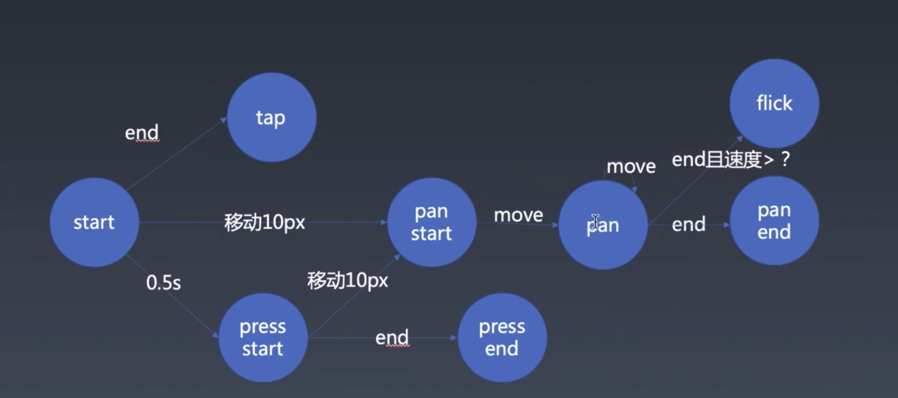

## 鼠标事件监听基本模型

```
element.addEventListener('mousedown', () => {
    let move = event => {
        console.log(event.clientX, event.clientY);
    }
    let end = event => {
        document.removeEventListener('mousemove', move)
        document.removeEventListener('mouseup', end)
    }
    document.addEventListener('mousemove', move)
    document.addEventListener('mouseup', end)
})
```
## touch事件基本模型

- event.changedTouches[0] 每个touch的并不是一一对应的
- pointerEvent


```
// touch 事件模型
element.addEventListener('touchstart', event => {
    console.log('touchstart');
    for (const touch of event.changedTouches) {
        move()
    }
})

element.addEventListener('touchmove', event => {
    console.log('touchmove');
})

element.addEventListener('touchend', event => {
    console.log('touchend');
})

element.addEventListener('touchcancel', event => {
    console.log('touchcancel');
})
```

## 两者结合
```
let element = document.body


// 鼠标事件模型
element.addEventListener('mousedown', (event) => {
    start(event)
    let mousemove = event => {
        move(event)
    }
    let mouseend = event => {
        end(event)
        document.removeEventListener('mousemove', mousemove)
        document.removeEventListener('mouseup', mouseend)
    }
    document.addEventListener('mousemove', mousemove)
    document.addEventListener('mouseup', mouseend)
})

// touch 事件模型
element.addEventListener('touchstart', event => {
    for (const touch of event.changedTouches) {
        start(touch)
    }
})

element.addEventListener('touchmove', event => {
    for (const touch of event.changedTouches) {
        move(touch)
    }
})

element.addEventListener('touchend', event => {
    for (const touch of event.changedTouches) {
        end(touch)
    }
})

element.addEventListener('touchcancel', event => {
    for (const touch of event.changedTouches) {
        cancel(touch)
    }
})


// touch 行为抽象
let start = (point) => {
    console.log('start');
    console.log(point.clientX, point.clientY);
}
let move = (point) => {
    console.log('move');
    console.log(point.clientX, point.clientY);
}
let end = (point) => {
    console.log('end');
    console.log(point.clientX, point.clientY);
}
let cancel = () => {
    console.log('cancel');
}
```


## 手势状态转换图
- tap

- pan - panstart panmove panend

- flick

- press pressstart pressend



监听->识别->分发


### 三种默认事件阻止行为 
```
   document.addEventListener('contextmenu', (event) => {
        event.preventDefault()
    })  // 右键菜单禁用
    document.addEventListener('selectstart', (event) => {
        event.preventDefault()
    }) // 右键菜单禁用
    document.addEventListener('touchmove', (event) => {
        event.preventDefault()
    }, {
        passive: false
    })
```

passive: false 解决移动端卡顿问题


## window.Touch 判断是PC模式还是移动端模式  
### 参考链接
passive 的事件监听器：https://www.cnblogs.com/ziyunfei/p/5545439.html

事件派发：
https://developer.mozilla.org/en-US/docs/Web/Guide/Events/Creating_and_triggering_events


## matrix
matrix(1,0,0,1,102.284)   rotate scale translate skew ,第四个参数skew如果没传可以完美反解。

```
1,0,102
0,1,102
0,0, 1 

```
css3里面可以用矩阵表示2D和3D转换
2D的转换是由一个3*3的矩阵表示的

矩阵运算常用来变幻，GPU计算比较快，同样在webGL中也是如此。矩阵运算同样运用在其他领域比如卷积神经网络（卷积核、滤波器）。


